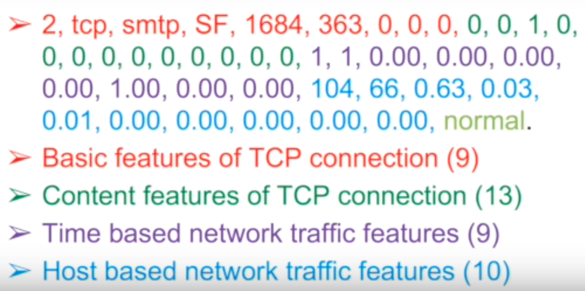

# KDD99 Computer Network Intrusion Detection

## Dataset
DARPA collected 9 weeks of TCPdump network connectivity and system audit data, simulating various user types, various network traffic and attack methods, with the 7-week's training data probably contains more than 5,000,000 network connection records, and the remaining 2 weeks of test data probably contains 2,000,000 network connection records.

Each network connection is marked as normal or abnormal. The exception type is subdivided into 4 types of 39 types of attacks. 22 types of attacks appear in the training set, and 17 unknown types of attacks appear in the test set. Besides, the test data is not from the same probability distribution as the training data.

The four types of anomalies are:
- DOS: denial-of-service
- R2L: unauthorized access from a remote machine to a local machine
- U2R: unauthorized access to local superuser privileges by a local unpivileged user
- PROBING: surveillance and probing

## Steps
- Data pre-processing
- Model selection and evaluation
- MapReduce
- Generalize method

## Data pre-processing
### Original

Source comes from [Analyze KDD99 data set by Sean Han](https://www.youtube.com/watch?v=mm38R3NsHso)

### Use NSL DataSet [6]
- Remove duplicated data
- Remove the easiest data
- Reduce bias on normal and dos attack

### Reduce demension
- PCA (Not perform well on this DataSet!)
- Feature selection : Use Information Coefficient to judge the degree of association (21 out of 42)
- K-means : model extraction (find each specific attack a best model)
- Normalization : Euclidean distance

## Models
### DT
### NB (Bad Accuracy)
### Random Forest
### KNN
### SVM (Should be the best)

## Evaluation
### Indicators

### Results

### Reason Analysis

## Usage
### Prerequisite

## Reference
[1] Özgür, Atilla and Hamit Erdem. “A review of KDD99 dataset usage in intrusion detection and machine learning between 2010 and 2015.” PeerJ PrePrints 4 (2016): e1954.

[2] Solutions to kdd99 dataset with Decision tree and Neural network by scikit-learn https://github.com/PENGZhaoqing/kdd99-scikit

[3] Results of the KDD'99 Classifier Learning Contest http://cseweb.ucsd.edu/~elkan/clresults.html

[4] KDD99 Data http://www.kdd.org/kdd-cup/view/kdd-cup-1999/Data

[5] K. Ibrahimi and M. Ouaddane, "Management of intrusion detection systems based-KDD99: Analysis with LDA and PCA," 2017 International Conference on Wireless Networks and Mobile Communications (WINCOM), Rabat, 2017, pp. 1-6

[6] M. Tavallaee, E. Bagheri, W. Lu, and A. Ghorbani, “A Detailed Analysis of the KDD CUP 99 Data Set,” Submitted to Second IEEE Symposium on Computational Intelligence for Security and Defense Applications (CISDA), 2009.
